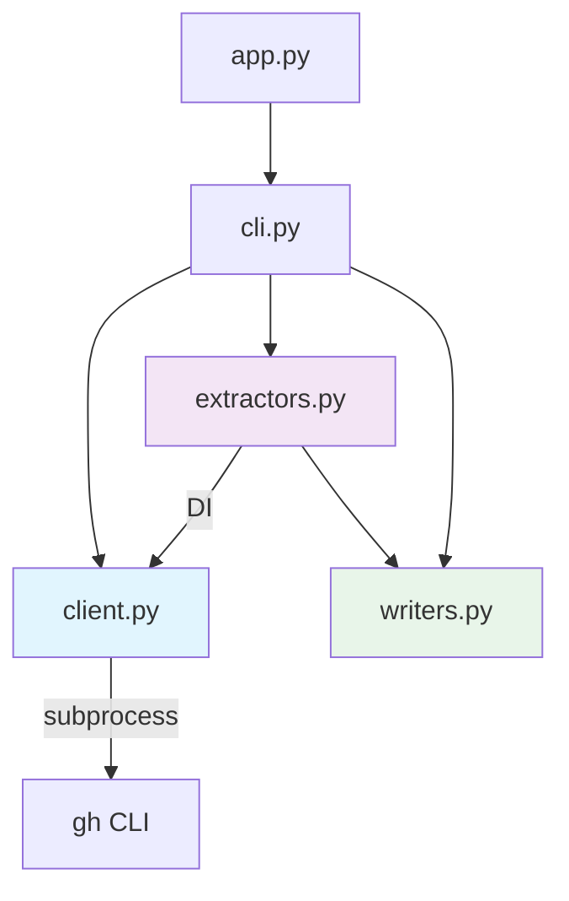
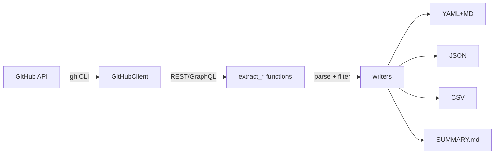

# Architecture

## Overview

GitHub 활동 데이터를 수집하여 LLM 친화적 Markdown 지식 베이스로 변환하는 CLI 도구.

## Module Dependency Graph



## Data Flow



## Module Inventory

| Module | Lines | Functions | Responsibility |
|---|---|---|---|
| `client.py` | 90 | 3 | `rest()`, `graphql()`, `get_authenticated_user()` |
| `extractors.py` | 893 | 10 | repos, contributed, commits, PRs, issues, reviews, stars, readmes, projects, orgs |
| `writers.py` | 251 | 5 | `write_md`, `generate_metadata`, `generate_timeline`, `generate_summary`, `_top_languages` |
| `cli.py` | 143 | 2 | `run()`, `whoami()` |

## Key Design Decisions

| # | Decision | Rationale |
|---|---|---|
| 1 | gh CLI subprocess | 인증/토큰 관리를 gh에 위임 — 직접 HTTP 불필요 |
| 2 | DI 패턴 | GitHubClient를 함수에 주입 → FakeGitHubClient로 테스트 격리 |
| 3 | 혼합 모듈 구조 | 공통 모듈(client, writers) 분리 + extractors 단일 파일 유지 |
| 4 | YAML frontmatter | LLM이 구조화된 메타데이터를 파싱하기 용이 |
| 5 | 월별 그룹핑 | commits, issues, reviews, stars를 YYYY-MM 단위로 집계 |

## Boundaries

```
┌─────────────────────────────────────────────┐
│ cli.py — orchestration + user interface     │
│  ┌──────────────┐  ┌─────────────────────┐  │
│  │ client.py    │  │ extractors.py       │  │
│  │ (I/O only)   │◄─┤ (business logic)    │  │
│  │ subprocess   │  │ API → domain → file │  │
│  └──────────────┘  └────────┬────────────┘  │
│                             │               │
│                    ┌────────▼────────────┐  │
│                    │ writers.py          │  │
│                    │ (pure functions)    │  │
│                    │ data → file format  │  │
│                    └────────────────────┘  │
└─────────────────────────────────────────────┘
```
