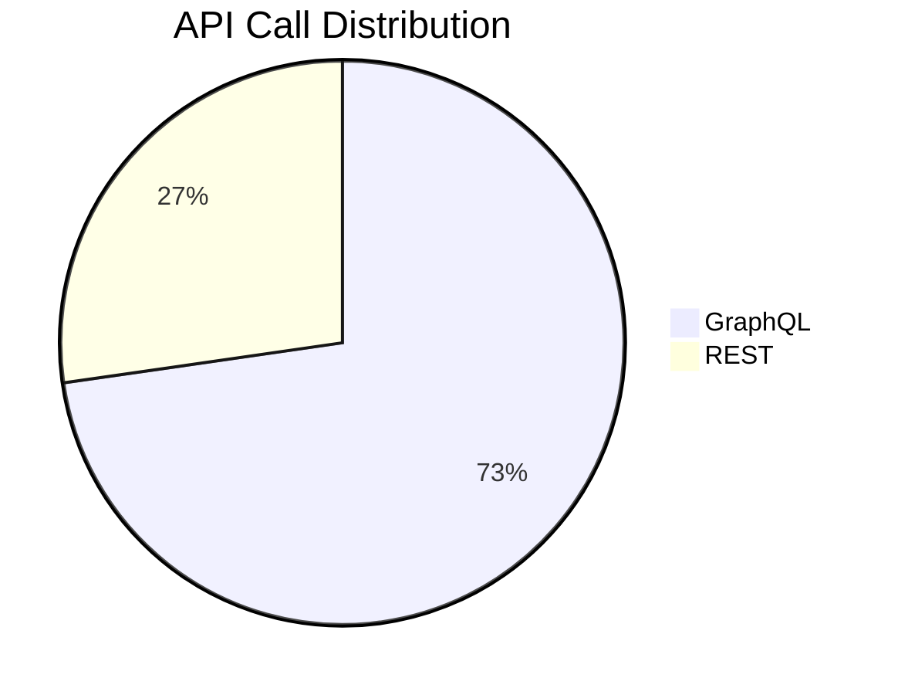

# Tech Stack

## Runtime

| Component | Version | Purpose |
|---|---|---|
| Python | 3.12+ | Language runtime |
| Typer | 0.9+ | CLI framework |
| gh CLI | 2.x | GitHub API access (REST + GraphQL) |

## Development

| Tool | Purpose |
|---|---|
| uv | Package manager + virtualenv |
| pytest | Test framework (44 tests) |
| git | Version control |

## API Usage

| Extractor | API Type | Pagination |
|---|---|---|
| Repositories (owned) | GraphQL | Cursor-based |
| Contributed Repos | GraphQL | Cursor-based |
| Commits | GraphQL | Cursor-based |
| Pull Requests | GraphQL | Cursor-based |
| Issues | GraphQL | Cursor-based |
| Code Reviews | GraphQL | Cursor-based |
| Projects v2 | GraphQL | Cursor-based |
| Stars | REST | Page/per_page |
| READMEs | REST | None (per-repo) |
| Organizations | REST | None (single call) |

## Output Formats

| Format | File | Purpose |
|---|---|---|
| Markdown + YAML | `*.md` | LLM-parseable structured docs |
| JSON | `metadata.json` | Machine-readable index |
| CSV | `timeline.csv` | Time-series analysis |
| Markdown | `SUMMARY.md` | Human/LLM activity report |
