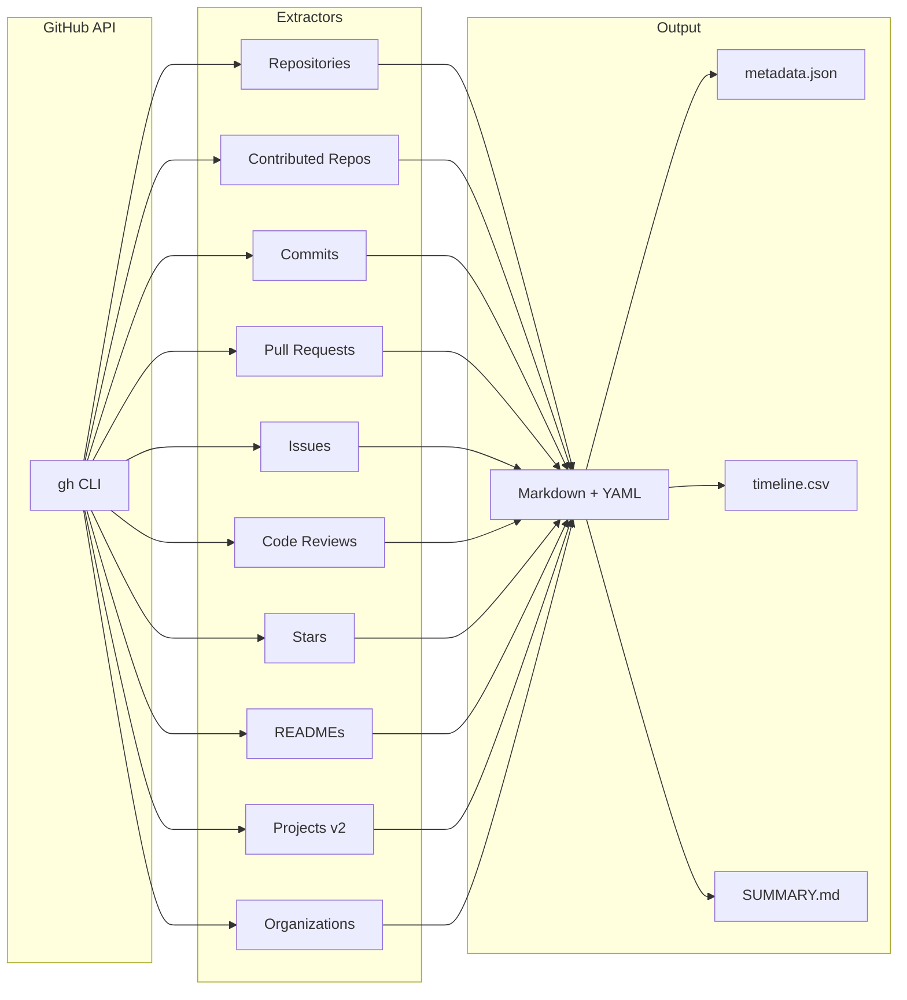
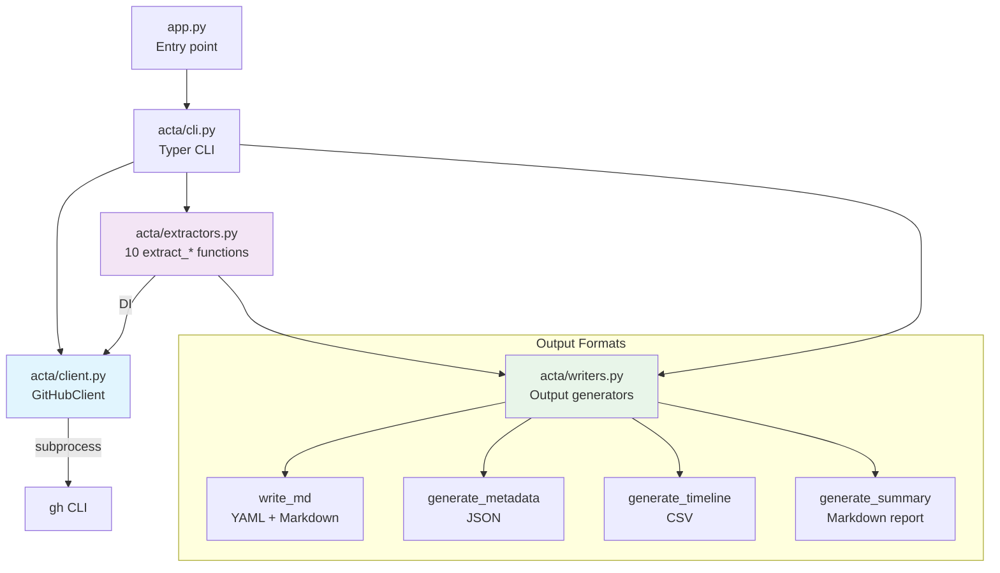

# Acta Ergo Sum

> *I act, therefore I am.*

A CLI tool that collects your GitHub activity and structures it into an
LLM-friendly **Markdown knowledge base** — complete with YAML Frontmatter,
a `metadata.json` index, a `timeline.csv` for time-series analysis, and a
`SUMMARY.md` activity report.

---

## What It Collects



| Data Source | API | Output | Grouping |
|---|---|---|---|
| Owned Repositories | GraphQL | `repositories/*.md` | Per repo |
| Contributed Repos | GraphQL | `repositories/*.md` | Per repo (deduped) |
| Commits | GraphQL | `commits/YYYY-MM.md` | Monthly |
| Pull Requests | GraphQL | `pull_requests/*.md` | Per PR |
| Issues | GraphQL | `issues/YYYY-MM.md` | Monthly |
| Code Reviews | GraphQL | `reviews/YYYY-MM.md` | Monthly |
| Stars | REST | `stars/YYYY-MM.md` | Monthly |
| READMEs | REST | `readmes/*_readme.md` | Per repo |
| Projects (v2) | GraphQL | `projects/*.md` | Per project |
| Organizations | REST | `organizations/*.md` | Per org |

---

## Prerequisites

| Requirement | Check | Notes |
|---|---|---|
| Python 3.12+ | `python3 --version` | |
| [uv](https://docs.astral.sh/uv/) | `uv --version` | Package manager |
| [GitHub CLI](https://cli.github.com/) | `gh auth status` | Must be authenticated |

## Installation

```bash
uv sync
```

## Usage

```bash
# Collect the last 365 days of activity (default)
uv run python app.py run

# Custom period and output directory
uv run python app.py run --days 90 --output ./my_data

# Fast run — skip slow/optional steps
uv run python app.py run --days 30 --skip-readmes --skip-stars

# Show authenticated user
uv run python app.py whoami
```

### Options

| Flag | Default | Description |
|---|---|---|
| `--days`, `-d` | `365` | How many past days of activity to collect |
| `--output`, `-o` | `./acta_data` | Output base directory |
| `--skip-readmes` | `false` | Skip README archival (faster) |
| `--skip-commits` | `false` | Skip commit extraction |
| `--skip-prs` | `false` | Skip pull request extraction |
| `--skip-issues` | `false` | Skip issue extraction |
| `--skip-reviews` | `false` | Skip code review extraction |
| `--skip-stars` | `false` | Skip star extraction |
| `--skip-contributed` | `false` | Skip contributed repos extraction |

---

## Output Structure

```text
acta_data/
├── repositories/          # One .md per repo (owned + contributed)
├── commits/               # YYYY-MM.md — commits grouped by month
├── pull_requests/         # One .md per PR (reviews, state, description)
├── issues/                # YYYY-MM.md — issues grouped by month
├── reviews/               # YYYY-MM.md — code reviews given by you
├── readmes/               # Archived README.md files
├── stars/                 # YYYY-MM.md — starred repos grouped by month
├── projects/              # GitHub Projects (v2) info
├── organizations/         # Orgs you belong to
├── metadata.json          # LLM-friendly index of everything
├── timeline.csv           # Chronological log: date, category, repo, action
└── SUMMARY.md             # Human/LLM-readable activity report
```

Each Markdown file starts with **YAML Frontmatter** for easy parsing:

```markdown
---
name: my-repo
created_at: 2023-01-15T10:00:00Z
language: Python
topics:
  - cli
  - data-engineering
is_fork: false
---

## my-repo
...
```

---

## Architecture



### Module Breakdown

| Module | Lines | Responsibility |
|---|---|---|
| `acta/client.py` | 90 | `GitHubClient` — REST/GraphQL via `gh` CLI subprocess |
| `acta/extractors.py` | 893 | 10 `extract_*` functions with DI + pagination |
| `acta/writers.py` | 251 | MD/JSON/CSV/Summary output (pure functions) |
| `acta/cli.py` | 143 | Typer CLI orchestration (`run`, `whoami`) |

### Design Decisions

| Decision | Rationale |
|---|---|
| Wrap `gh` CLI (not HTTP) | Delegates auth/token management to `gh` |
| Dependency Injection | `GitHubClient` injected into extractors for testability |
| `FakeGitHubClient` in tests | No subprocess calls — fast, deterministic tests |
| YAML frontmatter | LLM-parseable structured metadata in every file |
| Monthly grouping | Commits, issues, reviews, stars grouped by `YYYY-MM` |

---

## Testing

```bash
uv run pytest tests/ -v
```

| Test Module | Tests | Coverage |
|---|---|---|
| `test_client.py` | 9 | GitHubClient REST/GraphQL/auth |
| `test_extractors.py` | 20 | All 10 extractors via FakeClient |
| `test_writers.py` | 10 | MD/JSON/CSV/Summary output |
| `test_cli.py` | 4 | CLI end-to-end with CliRunner |
| **Total** | **44** | |

---

## License

MIT
