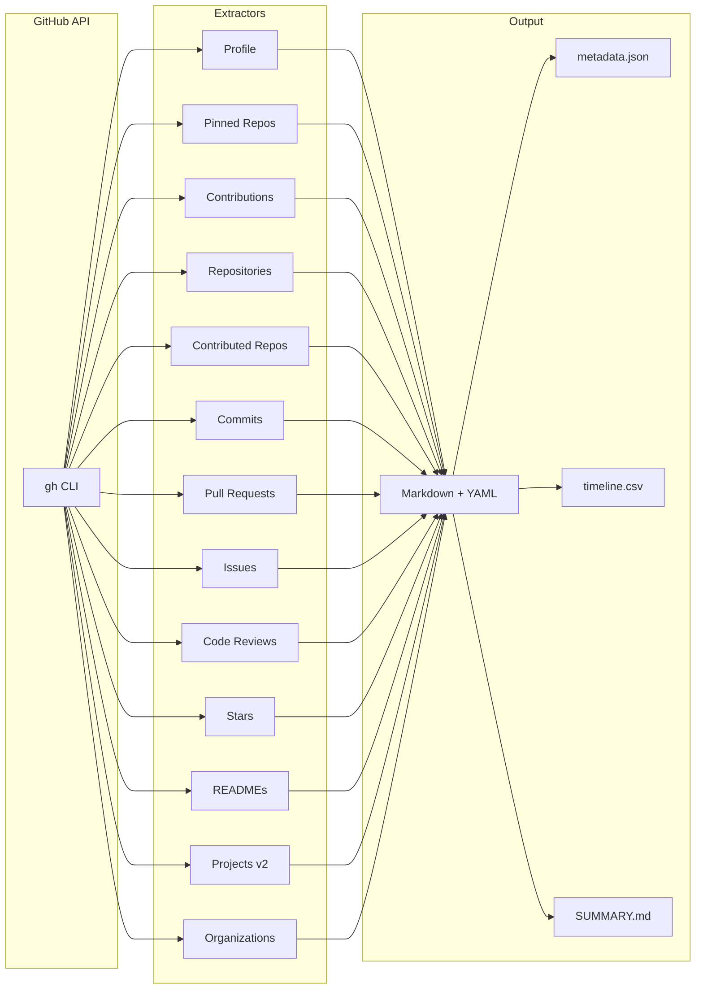
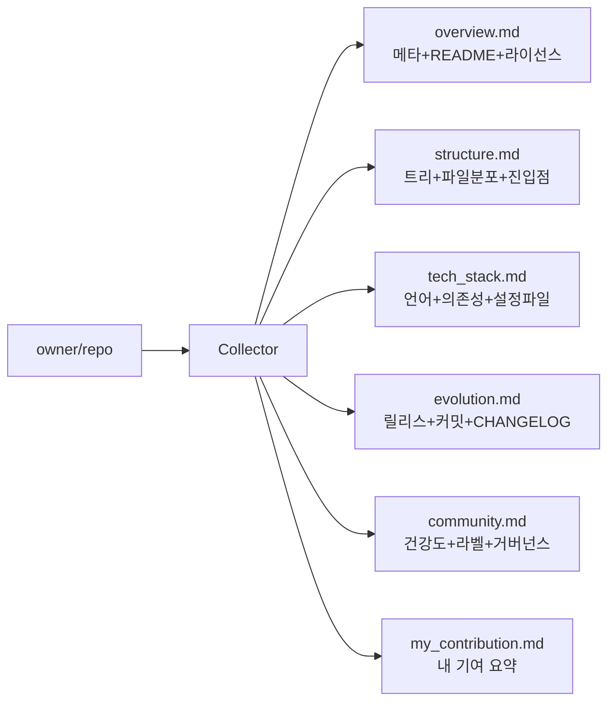
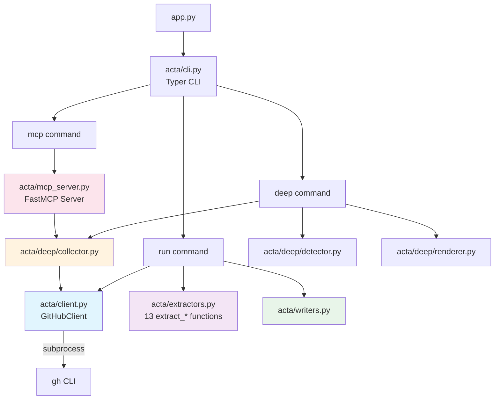

<role>
You are a senior software architect analyzing a GitHub repository to produce a comprehensive project summary.
You explain architecture and design intent based on empirical evidence (code structure, config files, commit history).
You always write in Korean.
</role>

<constraints>
- 데이터에 명시된 사실만 사용. 코드를 직접 읽지 않았으므로 구현 세부사항은 추론하지 말 것.
- 디렉토리 구조, 설정 파일, 의존성에서 아키텍처를 추론.
- 커밋 메시지와 릴리스 노트에서 설계 의도를 추론.
- 불확실한 추론은 "~로 보인다", "~로 추정된다"로 표현.
- 사용 금지: "잘 설계된", "깔끔한 코드", "효율적인" — 근거 없는 평가 금지.
</constraints>

<data>
### overview.md

---
name: SukbeomH/Acta-Ergo-Sum
url: https://github.com/SukbeomH/Acta-Ergo-Sum
description: I act, therefore I am.
language: Python
license: 
stars: 0
forks: 0
created_at: 2026-03-25T06:11:24Z
topics:
category: deep_overview
---

# SukbeomH/Acta-Ergo-Sum

> I act, therefore I am.

## Metadata

- **Language**: Python
- **License**: N/A
- **Created**: 2026-03-25
- **Last push**: 2026-03-26
- **Stars**: 0 | **Forks**: 0 | **Watchers**: 0
- **Issues**: 0 open / 0 closed
- **PRs**: 0 open / 3 merged

## README

[](https://github.com/SukbeomH/HExoskeleton)

# Acta Ergo Sum

> *I act, therefore I am.*

GitHub 활동 데이터를 LLM 친화적 **Markdown 지식 베이스**로 수집하고,
특정 레포지토리를 딥 분석하여 프로젝트의 구조/기술 스택/설계 의도를 추출하는 CLI 도구.

**두 가지 모드:**
- `acta run` — 내 GitHub 활동 전체를 수집 (이력서/포트폴리오용)
- `acta deep` — 특정 레포를 분석하여 LLM이 프로젝트를 이해할 수 있는 컨텍스트 생성
- `acta mcp` — MCP 서버로 LLM 에이전트에게 도구를 직접 노출

---

## What It Collects

### `acta run` — 사용자 활동 수집



| Data Source | API | Output |
|---|---|---|
| User Profile | GraphQL | `profile.md` |
| Pinned Repos | GraphQL | `pinned.md` |
| Contribution Calendar | GraphQL | `contributions.md` |
| Owned Repositories | GraphQL | `repositories/*.md` |
| Contributed Repos | GraphQL | `repositories/*.md` |
| Commits | GraphQL | `commits/YYYY-MM.md` |
| Pull Requests | GraphQL | `pull_requests/*.md` |
| Issues | GraphQL | `issues/YYYY-MM.md` |
| Code Reviews | GraphQL | `reviews/YYYY-MM.md` |
| Stars | GraphQL | `stars/YYYY-MM.md` |
| READMEs | REST | `readmes/*_readme.md` |
| Projects (v2) | GraphQL | `projects/*.md` |
| Organizations | REST | `organizations/*.md` |

### `acta deep` — 레포지토리 딥 분석

특정 레포를 분석하여 LLM이 "이 프로젝트가 뭐고, 어떻게 설계됐고, 왜 만들었는지"를 이해할 수 있는 컨텍스트를 생성.



| Section | 데이터 소스 | 목적 |
|---|---|---|
| `overview.md` | GraphQL + README | 프로젝트 정체성 |
| `structure.md` | Git Tree + Languages API | 아키텍처 파악 |
| `tech_stack.md` | Dependency Graph + 핵심 파일 | 기술 스택 이해 |
| `evolution.md` | Releases + Commits + CHANGELOG | 진화 내러티브 |
| `community.md` | Community Profile + Labels | 운영/거버넌스 |
| `my_contribution.md` | Stats API | 개인 기여 정량화 |

---

## Prerequisites

| Requirement | Check | Notes |
|---|---|---|
| Python 3.12+ | `python3 --version` | |
| [uv](https://docs.astral.sh/uv/) | `uv --version` | Package manager |
| [GitHub CLI](https://cli.github.com/) | `gh auth status` | Must be authenticated |

## Installation

```bash
uv sync                    # 기본 의존성
uv sync --extra mcp        # MCP 서버 포함
```

## Usage

### 활동 수집 (`run`)

```bash
# 최근 365일 활동 수집 (기본)
uv run python app.py run

# 기간 / 출력 경로 지정
uv run python app.py run --days 90 --output ./my_data

# 빠른 실행 — 느린 단계 건너뛰기
uv run python app.py run --days 30 --skip-readmes --skip-stars

# 인증 확인
uv run python app.py whoami
```

### 레포 딥 분석 (`deep`)

```bash
# 특정 레포 분석 → deep_analysis/{repo}/ 에 파일 생성
uv run python app.py deep owner/repo

# stdout 모드 — LLM 에이전트에 파이프
uv run python app.py deep owner/repo --stdout

# 내 기여 분석 포함
uv run python app.py deep owner/repo --include-me
```

### MCP 서버 (`mcp`)

```bash
# MCP 서버 시작 — Claude Code, Cursor 등에서 tool로 연결
uv run python app.py mcp
```

MCP로 노출되는 도구:

| Tool | 용도 |
|---|---|
| `deep_analyze_repo` | 전체 딥 분석 (섹션 선택 가능) |
| `get_repo_structure` | 디렉토리 트리 + 파일 분포 |
| `get_repo_key_files` | 핵심 설정 파일 내용 (manifest, CI, docs 등) |
| `get_repo_evolution` | 릴리스 + 커밋 + CHANGELOG |

### Options

| Flag | Default | Description |
|---|---|---|
| `--days`, `-d` | `365` | 수집 기간 (일) |
| `--months`, `-m` | `0` | 수집 기간 (월, --days 우선) |
| `--years`, `-y` | `0` | 수집 기간 (년) |
| `--output`, `-o` | `./acta_data` | 출력 디렉토리 |
| `--skip-readmes` | `false` | README 수집 건너뛰기 |
| `--skip-commits` | `false` | 커밋 수집 건너뛰기 |
| `--skip-prs` | `false` | PR 수집 건너뛰기 |
| `--skip-issues` | `false` | 이슈 수집 건너뛰기 |
| `--skip-reviews` | `false` | 리뷰 수집 건너뛰기 |
| `--skip-stars` | `false` | 스타 수집 건너뛰기 |
| `--skip-contributed` | `false` | 기여 레포 수집 건너뛰기 |
| `--since-last-run` | `false` | 마지막 실행 이후만 수집 |

---

## Output Structure

### `acta run` 출력

```text
acta_data/
├── profile.md             # 사용자 프로필 (bio, location, social)
├── pinned.md              # 핀된 레포 (포트폴리오 하이라이트)
├── contributions.md       # 잔디 데이터 (streak, 월별/요일별 집계)
├── repositories/          # 레포별 .md (owned + contributed)
├── commits/               # YYYY-MM.md — 월별 커밋
├── pull_requests/         # PR별 .md (리뷰, 상태, 설명)
├── issues/                # YYYY-MM.md — 월별 이슈
├── reviews/               # YYYY-MM.md — 코드 리뷰
├── readmes/               # README 아카이브
├── stars/                 # YYYY-MM.md — 스타 레포
├── projects/              # GitHub Projects v2
├── organizations/         # 소속 조직
├── metadata.json          # LLM용 인덱스
├── timeline.csv           # 시계열 로그
└── SUMMARY.md             # 활동 리포트
```

### `acta deep` 출력

```text
deep_analysis/{repo}/
├── overview.md            # 메타 + README + 라이선스
├── structure.md           # 트리 + 파일 분포 + 진입점
├── tech_stack.md          # 언어 + 의존성 + 설정 파일 내용
├── evolution.md           # 릴리스 노트 + CHANGELOG + 커밋 요약
├── community.md           # 건강도 + 라벨 분포 + 거버넌스
├── my_contribution.md     # (--include-me) 내 기여 통계
└── metadata.json          # 분석 메타데이터
```

---

## Architecture



### Module Breakdown

| Module | Responsibility |
|---|---|
| `acta/client.py` | `GitHubClient` — REST/GraphQL via `gh` CLI |
| `acta/extractors.py` | 13 `extract_*` functions (profile, pinned, calendar, repos, commits, PRs, issues, reviews, stars, readmes, projects, orgs, contributed) |
| `acta/writers.py` | MD/JSON/CSV/Summary 출력 |
| `acta/cli.py` | Typer CLI (`run`, `deep`, `mcp`, `analyze`, `whoami`) |
| `acta/deep/collector.py` | 레포 딥 분석 데이터 수집 |
| `acta/deep/detector.py` | 핵심 파일/진입점 자동 감지 |
| `acta/deep/renderer.py` | 딥 분석 마크다운 렌더링 |
| `acta/mcp_server.py` | FastMCP 서버 (4 tools) |

### Design Decisions

| Decision | Rationale |
|---|---|
| `gh` CLI 래핑 | 인증/토큰 관리를 `gh`에 위임 |
| Dependency Injection | `GitHubClient` 주입으로 테스트 격리 |
| `FakeGitHubClient` | subprocess 없는 빠른 테스트 |
| YAML Frontmatter | LLM 파싱 가능한 구조화 메타데이터 |
| `--stdout` 모드 | LLM 에이전트에 직접 파이프 가능 |
| MCP 서버 | Claude Code/Cursor 등에서 tool로 직접 호출 |
| 핵심 파일 자동 감지 | 매니페스트/CI/Dockerfile 등 패턴 매칭 |

---

## Testing

```bash
uv run pytest tests/ -v
```

| Test Module | Tests | Coverage |
|---|---|---|
| `test_client.py` | 9 | GitHubClient REST/GraphQL/auth |
| `test_extractors.py` | 30 | 13 extractors via FakeClient |
| `test_writers.py` | 10 | MD/JSON/CSV/Summary output |
| `test_cli.py` | 6 | CLI end-to-end with CliRunner |
| `test_deep.py` | 22 | Detector + Renderer |
| `test_analyzer.py` | 6 | Template loading + prompt building |
| **Total** | **83** | |

---

## License

MIT


### structure.md

---
total_files: 92
extensions: 12
category: deep_structure
---

# Project Structure

**Total files**: 92

## Languages

- Python: 88.6%
- Shell: 11.4%

## File Types

| Extension | Count |
|---|---|
| `.md` | 34 |
| `.py` | 21 |
| `.gitkeep` | 19 |
| `.sh` | 7 |
| `.json` | 3 |
| `.yml` | 2 |
| `.cursorrules` | 1 |
| `.gitignore` | 1 |
| `.yaml` | 1 |
| `.python-version` | 1 |
| `.windsurfrules` | 1 |
| `.toml` | 1 |

## Directory Tree

```
.claude/
  settings.json
  skills/
    commit/
      SKILL.md
    executor/
      SKILL.md
    handoff/
      SKILL.md
    memory-protocol/
      SKILL.md
    planner/
      SKILL.md
    verifier/
      SKILL.md
.cursorrules
.github/
  copilot-instructions.md
  workflows/
    ci.yml
    publish.yml
.gitignore
.hxsk/
  ARCHITECTURE.md
  PATTERNS.md
  STACK.md
  STATE.md
  archive/
    .gitkeep
  hooks/
    _json_parse.sh
    bash-guard.py
    file-protect.py
    md-recall-memory.sh
    md-store-memory.sh
    pre-compact-save.sh
    session-start.sh
    stop-context-save.sh
    track-modifications.sh
  memories/
    _schema/
      base.schema.json
    architecture-decision/
      .gitkeep
    bootstrap/
      .gitkeep
      2026-03-25_project-bootstrap.md
    debug-blocked/
      .gitkeep
    debug-eliminated/
      .gitkeep
    decision/
      .gitkeep
    deviation/
      .gitkeep
    execution-summary/
      .gitkeep
    general/
      .gitkeep
      2026-03-25_session-handoff-hxsk.md
    health-event/
      .gitkeep
    pattern-discovery/
      .gitkeep
    pattern/
      .gitkeep
    root-cause/
      .gitkeep
    security-finding/
      .gitkeep
    session-handoff/
      .gitkeep
    session-snapshot/
      .gitkeep
    session-summary/
      .gitkeep
  phases/
    2/
      01-PLAN.md
      02-PLAN.md
      03-PLAN.md
      04-PLAN.md
      05-PLAN.md
      PHASE.md
    3/
      01-PLAN.md
      02-PLAN.md
      03-PLAN.md
      04-PLAN.md
      05-PLAN.md
      PHASE.md
  project-config.yaml
  reports/
    .gitkeep
  research/
    .gitkeep
.python-version
.superset/
  config.json
.windsurfrules
AGENTS.md
CLAUDE.md
README.md
acta/
  __init__.py
  analyzer.py
  cli.py
  client.py
  deep/
    __init__.py
    collector.py
    detector.py
    renderer.py
  extractors.py
  mcp_server.py
  writers.py
app.py
docs/
  plans/
    2026-03-25-incremental-update-design.md
    2026-03-25-llm-analysis-design.md
    2026-03-25-structure-refactor-design.md
pyproject.toml
templates/
  profile.md
  resume.md
  weekly.md
tests/
  __init__.py
  test_analyzer.py
  test_cli.py
  test_client.py
  test_deep.py
  test_extractors.py
  test_writers.py
```

## Key Files Detected

### Manifest
- `pyproject.toml`

### Ci
- `.github/workflows/ci.yml`
- `.github/workflows/publish.yml`

## Entry Points (estimated)

- `app.py`
- `acta/cli.py`


### tech_stack.md

---
languages:
  - Python
  - Shell
dependency_managers:
category: deep_tech_stack
---

# Tech Stack

## Languages

- Python: 88.6%
- Shell: 11.4%

## Configuration Files

### `pyproject.toml`

```toml
[project]
name = "acta-ergo-sum"
version = "0.1.0"
description = "GitHub activity data extractor — I act, therefore I am."
readme = "README.md"
license = "MIT"
requires-python = ">=3.12"
authors = [
    { name = "Sukbeom H" },
]
keywords = ["github", "cli", "portfolio", "resume", "knowledge-base", "llm", "mcp"]
classifiers = [
    "Development Status :: 4 - Beta",
    "Programming Language :: Python :: 3",
    "Programming Language :: Python :: 3.12",
    "Programming Language :: Python :: 3.13",
    "License :: OSI Approved :: MIT License",
    "Topic :: Software Development :: Documentation",
    "Topic :: Software Development :: Libraries",
    "Environment :: Console",
    "Intended Audience :: Developers",
]
dependencies = [
    "typer>=0.9.0",
]

[project.optional-dependencies]
mcp = ["mcp[cli]>=1.0.0"]

[project.urls]
Homepage = "https://github.com/SukbeomH/Acta-Ergo-Sum"
Repository = "https://github.com/SukbeomH/Acta-Ergo-Sum"
Issues = "https://github.com/SukbeomH/Acta-Ergo-Sum/issues"

[project.scripts]
acta = "acta.cli:app"

[build-system]
requires = ["hatchling"]
build-backend = "hatchling.build"

[tool.hatch.build.targets.wheel]
packages = ["acta"]

[dependency-groups]
dev = [
    "pytest>=8.0",
]

```

### `.github/workflows/ci.yml`

```yml
name: CI

on:
  push:
    branches: [master, main]
  pull_request:
    branches: [master, main]

jobs:
  test:
    runs-on: ubuntu-latest
    strategy:
      matrix:
        python-version: ["3.12", "3.13"]

    steps:
      - uses: actions/checkout@v4

      - uses: astral-sh/setup-uv@v5
        with:
          version: "latest"

      - name: Set up Python ${{ matrix.python-version }}
        run: uv python install ${{ matrix.python-version }}

      - run: uv sync --dev
      - run: uv run pytest tests/ -v

```

### `.github/workflows/publish.yml`

```yml
name: Publish to PyPI

on:
  push:
    tags:
      - "v*"

jobs:
  test:
    runs-on: ubuntu-latest
    steps:
      - uses: actions/checkout@v4

      - uses: astral-sh/setup-uv@v5
        with:
          version: "latest"

      - run: uv sync --dev
      - run: uv run pytest tests/ -v

  publish:
    needs: test
    runs-on: ubuntu-latest
    environment: pypi
    permissions:
      id-token: write

    steps:
      - uses: actions/checkout@v4

      - uses: astral-sh/setup-uv@v5
        with:
          version: "latest"

      - run: uv build
      - run: uv publish --trusted-publishing always

```


### evolution.md

---
releases_count: 0
commits_sampled: 28
category: deep_evolution
---

# Project Evolution

## Releases

No releases published.

## Recent Commits

- `2026-03-26` `d98ee37` **SukbeomH** — docs: update CLAUDE.md and AGENTS.md for deep/mcp/publishing
- `2026-03-26` `d7f4af9` **SukbeomH** — chore: add PyPI publishing setup and CI workflows
- `2026-03-26` `5d20770` **SukbeomH** — feat: add deep repo analysis and MCP server
- `2026-03-26` `28526da` **SukbeomH** — feat: add profile, pinned repos, contribution calendar extractors
- `2026-03-26` `b5add65` **SukbeomH** — hexoskeleton
- `2026-03-26` `1bc0186` **SukbeomH** — Merge pull request #3 from SukbeomH/SukbeomH/poc
- `2026-03-26` `78e3332` **SukbeomH** — feat: enrich profiling data (Phase 3 — all 5 plans)
- `2026-03-25` `e8c2ae7` **SukbeomH** — docs: add Phase 3 plans — profiling data enrichment (5 plans)
- `2026-03-25` `2c7ca9c` **SukbeomH** — fix: switch stars extractor from REST to GraphQL
- `2026-03-25` `3cc3b2b` **SukbeomH** — feat: add --months and --years CLI options for period selection
- `2026-03-25` `9807a3b` **SukbeomH** — feat: add LLM analysis pipeline with prompt templates
- `2026-03-25` `922359a` **SukbeomH** — feat: add --since-last-run for incremental updates
- `2026-03-25` `bd9bf1d` **SukbeomH** — docs: update README and project docs with full feature coverage
- `2026-03-25` `bdd750e` **SukbeomH** — test: add CLI integration tests with CliRunner (Plan 2.5)
- `2026-03-25` `b0b4bdd` **SukbeomH** — feat: add SUMMARY.md report generation (Plan 2.4)
- `2026-03-25` `4815d7b` **SukbeomH** — feat: add code review extractor (Plan 2.3)
- `2026-03-25` `6e60008` **SukbeomH** — feat: add contributed repos and issues extractors (Plans 2.1, 2.2)
- `2026-03-25` `3a4ac6c` **SukbeomH** — docs: add Phase 2 implementation plans (5 plans, 3 waves)
- `2026-03-25` `23d17fc` **SukbeomH** — Merge pull request #2 from SukbeomH/SukbeomH/poc
- `2026-03-25` `c2a4924` **SukbeomH** — chore: complete HXSK bootstrap — memory dirs, docs, schema
- `2026-03-25` `4c6c559` **SukbeomH** — fix: add pagination support to extract_stars REST API calls
- `2026-03-25` `8c6e45b` **SukbeomH** — chore: add HXSK configuration with hooks, skills, and memory system
- `2026-03-25` `40ee181` **SukbeomH** — refactor: modularize single-file app into testable package structure
- `2026-03-25` `0030faf` **SukbeomH** — Merge pull request #1 from SukbeomH/copilot/add-github-activity-extractor
- `2026-03-25` `5de25fe` **Copilot** — chore: remove __pycache__ from tracking
- `2026-03-25` `cc3dfda` **Copilot** — feat: implement Acta Ergo Sum GitHub activity data extractor
- `2026-03-25` `235a109` **Copilot** — Initial plan
- `2026-03-25` `16aa122` **SukbeomH** — Initial commit


### community.md

---
health_percentage: 0
category: deep_community
---

# Community & Governance

## Community Health: 0%

- **README**: No
- **LICENSE**: No
- **CONTRIBUTING**: No
- **CODE_OF_CONDUCT**: No
- **ISSUE_TEMPLATE**: No
- **PULL_REQUEST_TEMPLATE**: No

## Issue Labels

| Label | Issues |
|---|---|


</data>

<instructions>
위 데이터를 분석하여 다음 구조의 프로젝트 요약을 생성하세요:

1. **프로젝트 개요** (3-5문장):
   - 이 프로젝트가 무엇인지, 어떤 문제를 해결하는지
   - 대상 사용자/유스케이스
   - README에서 추출한 핵심 가치

2. **기술 스택**:
   | 카테고리 | 기술 | 근거 |
   |---|---|---|
   - 언어 (비율), 프레임워크 (의존성), 빌드도구, CI/CD, 인프라
   - 각 기술의 근거 (어떤 파일/설정에서 확인)

3. **아키텍처 분석**:
   - 디렉토리 구조에서 파악한 설계 패턴 (MVC, 모듈, 모노레포 등)
   - 핵심 모듈/컴포넌트와 각각의 역할 (추정)
   - 진입점 파일과 실행 흐름

4. **설계 의도 추론**:
   - CI/CD 설정에서 추론한 품질 기준
   - Dockerfile/인프라 설정에서 추론한 배포 대상
   - 커밋 메시지 패턴에서 추론한 개발 문화 (conventional commits 등)

5. **프로젝트 성숙도**:
   - 릴리스 이력과 버전 관리 방식
   - 커뮤니티 건강도 (README, LICENSE, CONTRIBUTING 유무)
   - 활동 추세 (최근 커밋 빈도, 마지막 업데이트)

6. **포트폴리오 한줄 요약**:
   - 이력서/포트폴리오에 넣을 수 있는 1문장 프로젝트 설명
   - 기술 키워드 3-5개

Output: clean Markdown. 섹션별 헤더(##) 사용.
</instructions>

<reminder>
이 분석의 목적은 LLM이나 사람이 이 프로젝트를 빠르게 이해할 수 있게 하는 것입니다.
"이 프로젝트가 뭐고, 어떻게 만들어졌고, 왜 이런 선택을 했는지"에 집중하세요.
</reminder>