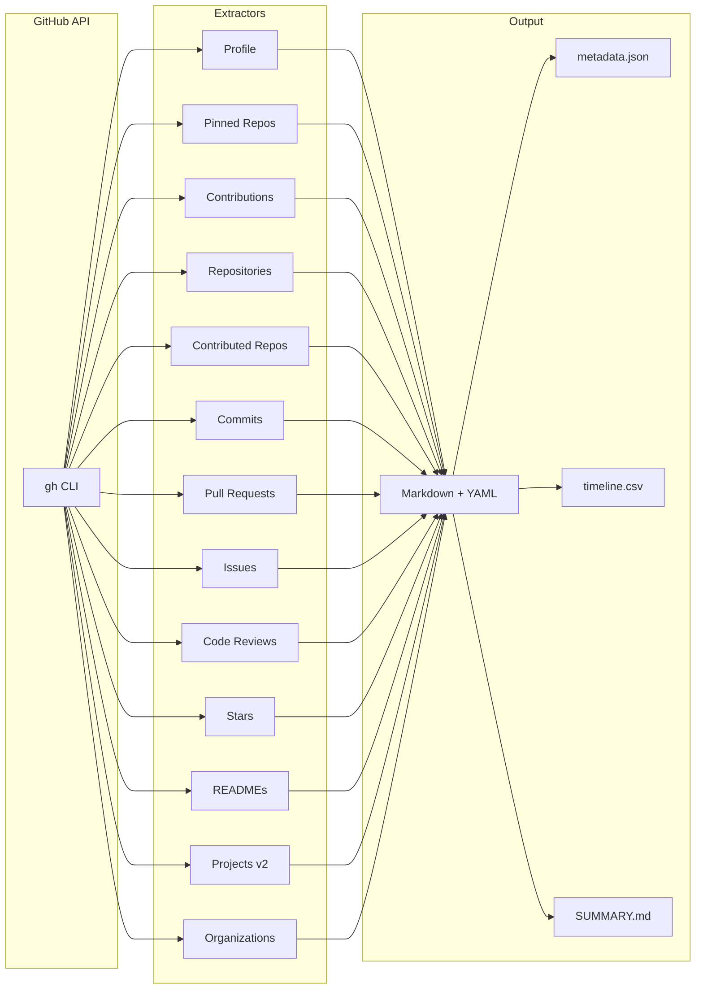
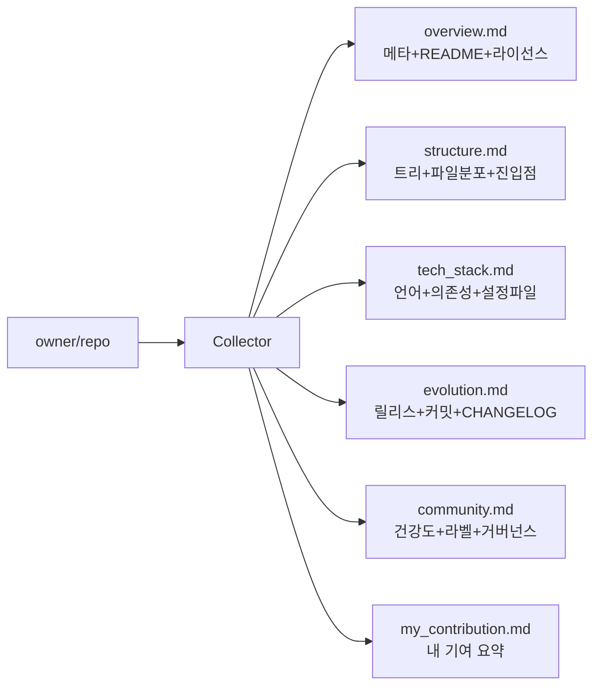
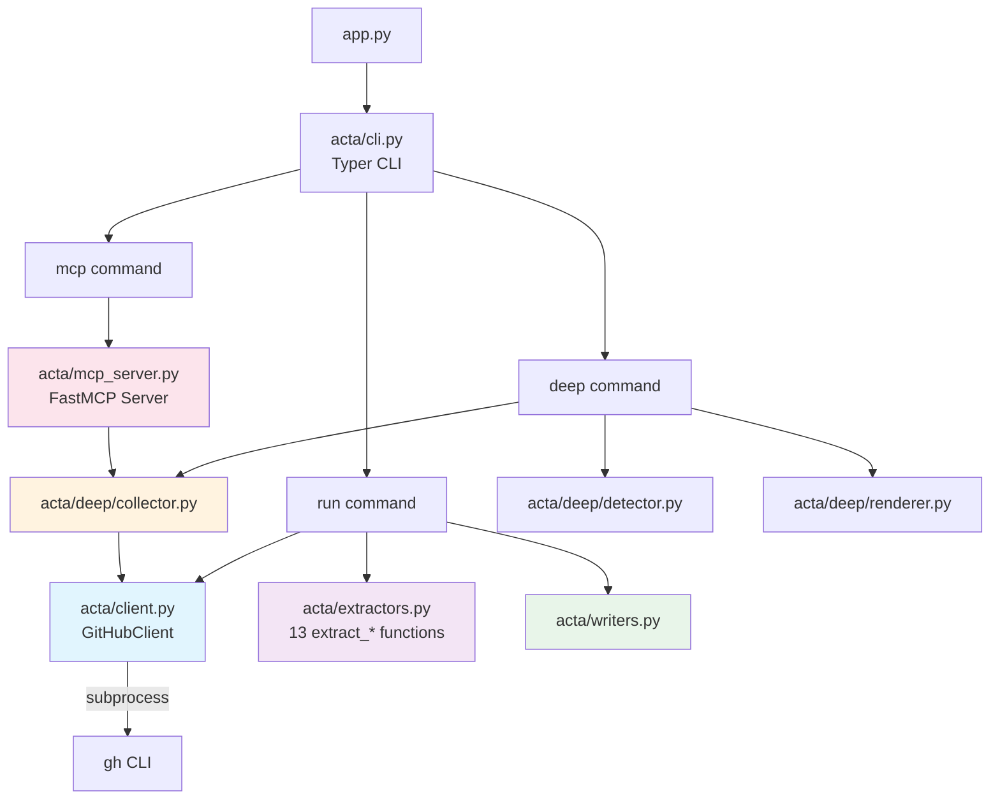

# SukbeomH/Acta-Ergo-Sum

> I act, therefore I am.

## Metadata

- **Language**: Python
- **License**: N/A
- **Created**: 2026-03-25
- **Last push**: 2026-03-26
- **Stars**: 0 | **Forks**: 0 | **Watchers**: 0
- **Issues**: 0 open / 0 closed
- **PRs**: 0 open / 3 merged

## README

[](https://github.com/SukbeomH/HExoskeleton)

# Acta Ergo Sum

> *I act, therefore I am.*

GitHub 활동 데이터를 LLM 친화적 **Markdown 지식 베이스**로 수집하고,
특정 레포지토리를 딥 분석하여 프로젝트의 구조/기술 스택/설계 의도를 추출하는 CLI 도구.

**두 가지 모드:**
- `acta run` — 내 GitHub 활동 전체를 수집 (이력서/포트폴리오용)
- `acta deep` — 특정 레포를 분석하여 LLM이 프로젝트를 이해할 수 있는 컨텍스트 생성
- `acta mcp` — MCP 서버로 LLM 에이전트에게 도구를 직접 노출

---

## What It Collects

### `acta run` — 사용자 활동 수집



| Data Source | API | Output |
|---|---|---|
| User Profile | GraphQL | `profile.md` |
| Pinned Repos | GraphQL | `pinned.md` |
| Contribution Calendar | GraphQL | `contributions.md` |
| Owned Repositories | GraphQL | `repositories/*.md` |
| Contributed Repos | GraphQL | `repositories/*.md` |
| Commits | GraphQL | `commits/YYYY-MM.md` |
| Pull Requests | GraphQL | `pull_requests/*.md` |
| Issues | GraphQL | `issues/YYYY-MM.md` |
| Code Reviews | GraphQL | `reviews/YYYY-MM.md` |
| Stars | GraphQL | `stars/YYYY-MM.md` |
| READMEs | REST | `readmes/*_readme.md` |
| Projects (v2) | GraphQL | `projects/*.md` |
| Organizations | REST | `organizations/*.md` |

### `acta deep` — 레포지토리 딥 분석

특정 레포를 분석하여 LLM이 "이 프로젝트가 뭐고, 어떻게 설계됐고, 왜 만들었는지"를 이해할 수 있는 컨텍스트를 생성.



| Section | 데이터 소스 | 목적 |
|---|---|---|
| `overview.md` | GraphQL + README | 프로젝트 정체성 |
| `structure.md` | Git Tree + Languages API | 아키텍처 파악 |
| `tech_stack.md` | Dependency Graph + 핵심 파일 | 기술 스택 이해 |
| `evolution.md` | Releases + Commits + CHANGELOG | 진화 내러티브 |
| `community.md` | Community Profile + Labels | 운영/거버넌스 |
| `my_contribution.md` | Stats API | 개인 기여 정량화 |

---

## Prerequisites

| Requirement | Check | Notes |
|---|---|---|
| Python 3.12+ | `python3 --version` | |
| [uv](https://docs.astral.sh/uv/) | `uv --version` | Package manager |
| [GitHub CLI](https://cli.github.com/) | `gh auth status` | Must be authenticated |

## Installation

```bash
uv sync                    # 기본 의존성
uv sync --extra mcp        # MCP 서버 포함
```

## Usage

### 활동 수집 (`run`)

```bash
# 최근 365일 활동 수집 (기본)
uv run python app.py run

# 기간 / 출력 경로 지정
uv run python app.py run --days 90 --output ./my_data

# 빠른 실행 — 느린 단계 건너뛰기
uv run python app.py run --days 30 --skip-readmes --skip-stars

# 인증 확인
uv run python app.py whoami
```

### 레포 딥 분석 (`deep`)

```bash
# 특정 레포 분석 → deep_analysis/{repo}/ 에 파일 생성
uv run python app.py deep owner/repo

# stdout 모드 — LLM 에이전트에 파이프
uv run python app.py deep owner/repo --stdout

# 내 기여 분석 포함
uv run python app.py deep owner/repo --include-me
```

### MCP 서버 (`mcp`)

```bash
# MCP 서버 시작 — Claude Code, Cursor 등에서 tool로 연결
uv run python app.py mcp
```

MCP로 노출되는 도구:

| Tool | 용도 |
|---|---|
| `deep_analyze_repo` | 전체 딥 분석 (섹션 선택 가능) |
| `get_repo_structure` | 디렉토리 트리 + 파일 분포 |
| `get_repo_key_files` | 핵심 설정 파일 내용 (manifest, CI, docs 등) |
| `get_repo_evolution` | 릴리스 + 커밋 + CHANGELOG |

### Options

| Flag | Default | Description |
|---|---|---|
| `--days`, `-d` | `365` | 수집 기간 (일) |
| `--months`, `-m` | `0` | 수집 기간 (월, --days 우선) |
| `--years`, `-y` | `0` | 수집 기간 (년) |
| `--output`, `-o` | `./acta_data` | 출력 디렉토리 |
| `--skip-readmes` | `false` | README 수집 건너뛰기 |
| `--skip-commits` | `false` | 커밋 수집 건너뛰기 |
| `--skip-prs` | `false` | PR 수집 건너뛰기 |
| `--skip-issues` | `false` | 이슈 수집 건너뛰기 |
| `--skip-reviews` | `false` | 리뷰 수집 건너뛰기 |
| `--skip-stars` | `false` | 스타 수집 건너뛰기 |
| `--skip-contributed` | `false` | 기여 레포 수집 건너뛰기 |
| `--since-last-run` | `false` | 마지막 실행 이후만 수집 |

---

## Output Structure

### `acta run` 출력

```text
acta_data/
├── profile.md             # 사용자 프로필 (bio, location, social)
├── pinned.md              # 핀된 레포 (포트폴리오 하이라이트)
├── contributions.md       # 잔디 데이터 (streak, 월별/요일별 집계)
├── repositories/          # 레포별 .md (owned + contributed)
├── commits/               # YYYY-MM.md — 월별 커밋
├── pull_requests/         # PR별 .md (리뷰, 상태, 설명)
├── issues/                # YYYY-MM.md — 월별 이슈
├── reviews/               # YYYY-MM.md — 코드 리뷰
├── readmes/               # README 아카이브
├── stars/                 # YYYY-MM.md — 스타 레포
├── projects/              # GitHub Projects v2
├── organizations/         # 소속 조직
├── metadata.json          # LLM용 인덱스
├── timeline.csv           # 시계열 로그
└── SUMMARY.md             # 활동 리포트
```

### `acta deep` 출력

```text
deep_analysis/{repo}/
├── overview.md            # 메타 + README + 라이선스
├── structure.md           # 트리 + 파일 분포 + 진입점
├── tech_stack.md          # 언어 + 의존성 + 설정 파일 내용
├── evolution.md           # 릴리스 노트 + CHANGELOG + 커밋 요약
├── community.md           # 건강도 + 라벨 분포 + 거버넌스
├── my_contribution.md     # (--include-me) 내 기여 통계
└── metadata.json          # 분석 메타데이터
```

---

## Architecture



### Module Breakdown

| Module | Responsibility |
|---|---|
| `acta/client.py` | `GitHubClient` — REST/GraphQL via `gh` CLI |
| `acta/extractors.py` | 13 `extract_*` functions (profile, pinned, calendar, repos, commits, PRs, issues, reviews, stars, readmes, projects, orgs, contributed) |
| `acta/writers.py` | MD/JSON/CSV/Summary 출력 |
| `acta/cli.py` | Typer CLI (`run`, `deep`, `mcp`, `analyze`, `whoami`) |
| `acta/deep/collector.py` | 레포 딥 분석 데이터 수집 |
| `acta/deep/detector.py` | 핵심 파일/진입점 자동 감지 |
| `acta/deep/renderer.py` | 딥 분석 마크다운 렌더링 |
| `acta/mcp_server.py` | FastMCP 서버 (4 tools) |

### Design Decisions

| Decision | Rationale |
|---|---|
| `gh` CLI 래핑 | 인증/토큰 관리를 `gh`에 위임 |
| Dependency Injection | `GitHubClient` 주입으로 테스트 격리 |
| `FakeGitHubClient` | subprocess 없는 빠른 테스트 |
| YAML Frontmatter | LLM 파싱 가능한 구조화 메타데이터 |
| `--stdout` 모드 | LLM 에이전트에 직접 파이프 가능 |
| MCP 서버 | Claude Code/Cursor 등에서 tool로 직접 호출 |
| 핵심 파일 자동 감지 | 매니페스트/CI/Dockerfile 등 패턴 매칭 |

---

## Testing

```bash
uv run pytest tests/ -v
```

| Test Module | Tests | Coverage |
|---|---|---|
| `test_client.py` | 9 | GitHubClient REST/GraphQL/auth |
| `test_extractors.py` | 30 | 13 extractors via FakeClient |
| `test_writers.py` | 10 | MD/JSON/CSV/Summary output |
| `test_cli.py` | 6 | CLI end-to-end with CliRunner |
| `test_deep.py` | 22 | Detector + Renderer |
| `test_analyzer.py` | 6 | Template loading + prompt building |
| **Total** | **83** | |

---

## License

MIT

